---
lab:
    title: 'Lab1 仮想マシンを作成する	'
    learning path: '01'
    module: 'Module2 Azureのコアサービス'
---

# ラボ 01: 仮想マシンを作成する

## ラボ シナリオ

あなたの会社では、Azure上で新規にWebサーバーを構築する予定です。Azure Virtual Machine のサービスを使い、Windows の仮想マシンを Azure 上に構築します。構築した仮想マシンにサインインし、[Internet Information Services (IIS)](https://docs.microsoft.com/ja-jp/iis/get-started/introduction-to-iis/introduction-to-iis-architecture)を設定し、Webページを公開します。


#### 推定時間: 20 分

## 演習 1 - Azure Virtual Machine から「仮想マシン」を作成

### タスク 1 - 仮想マシンを作成する

1. [https://portal.azure.com](https://portal.azure.com) に講師から指示された ID とパスワードでサインインします。

     | 設定       | 値                                         |
     | ---------- | ------------------------------------------ |
     | ユーザー名 | **azurestudent##@ctctedu.onmicrosoft.com** |
     | パスワード | Pa55w.rd1234                               |

     > 注：##は受講番号です。01 ～ 99の数字が入ります。

     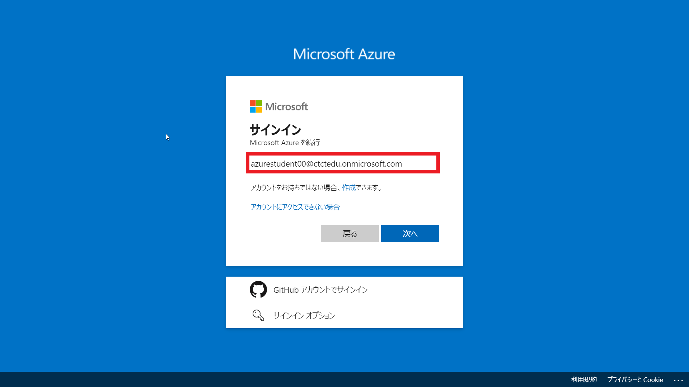

     

2. ポータルメニューの検索バーに［Virtual Machine］と入力して検索結果を選択します。

     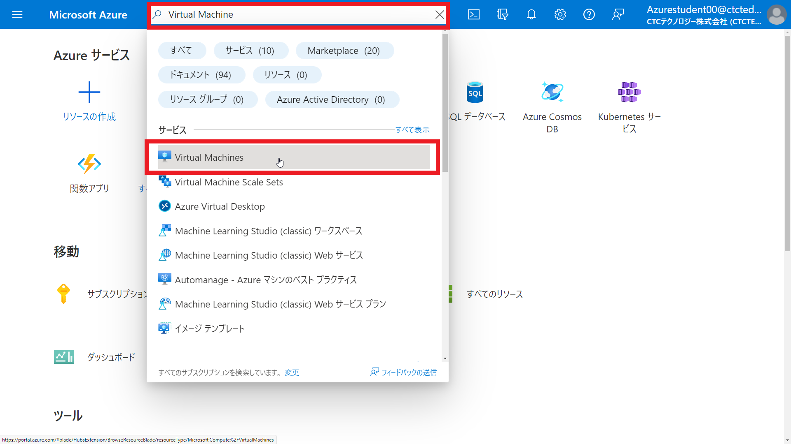

     

3. 画面左上にある[**＋作成**]→「**＋Azure仮想マシン**」を選択します。

     

     

4. 仮想マシンの作成画面が表示されます。「**プロジェクトの詳細**」を入力します。

     | 設定               | 値                                   |
     | ------------------ | ------------------------------------ |
     | サブスクリプション | **Microsoft Azure スポンサープラン** |
     | リソースグループ   | **AzureStudent##**                   |

     > 注：##は受講番号です。01 ～ 99の数字が入ります。
     >
     > 注：リソースグループがない場合は、「新規作成」を選択し、作成します。

     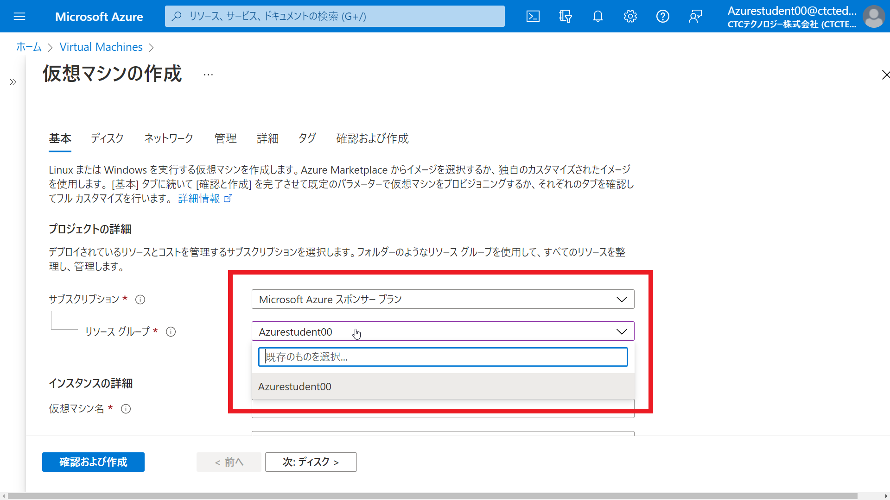

     

5. 「**インスタンスの詳細**」を入力します。

     | **設定**| **値**|
     | :--- | :--- |
     | 仮想マシン名 | **Server##-1** |
     | 地域| **(Asia Pacific) Japan East** |
     | 可用性オプション | **インフラストラクチャ冗長は必要ありません** |
     | イメージ | **Windows Server 2022 Datacenter: Azure Edition - x64 Gen2** |
     | Azure Spot 割引で実行する | **チェックなし** |
     | サイズ | **Standard_DS1_V2** |

     > 注：サイズが見つからない場合は、「すべてのサイズを表示」から検索してください。
     >
     > 　　または1コアのCPUであれば、別のシリーズを選択しても構いません。

     

     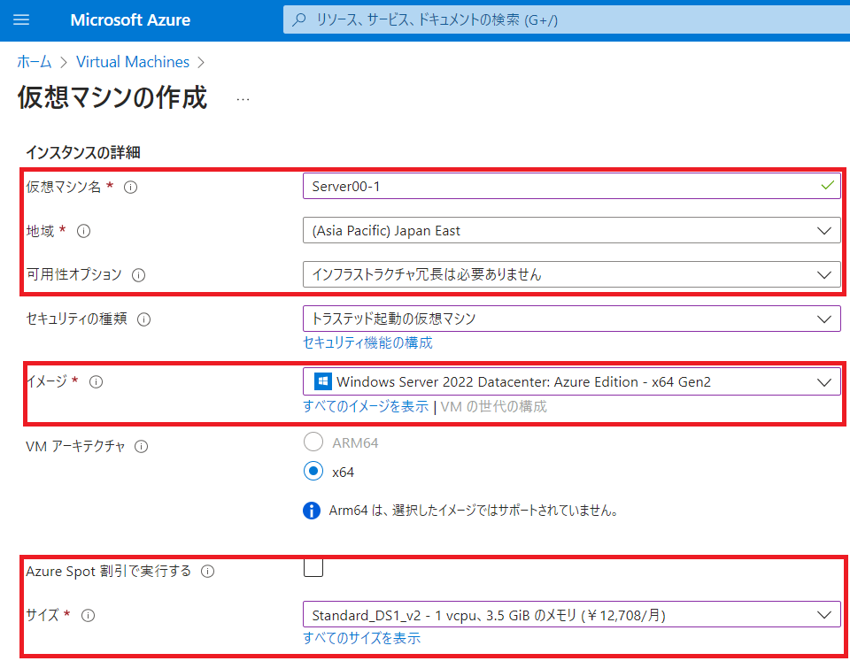

     

6. 「**管理者アカウント**」を入力します。

     | 設定       | 値                  |
     | ---------- | ------------------- |
     | ユーザー名 | **admsv**           |
     | パスワード | **Pa55w.rdabc1234** |

     

     

     

7. 「**受信ポートの規則**」を入力します。

     | 設定                 | 値                           |
     | -------------------- | ---------------------------- |
     | パブリック受信ポート | **選択したポートを許可する** |
     | 受信ポートを選択     | **HTTP(80) , RDP(3389)**     |

     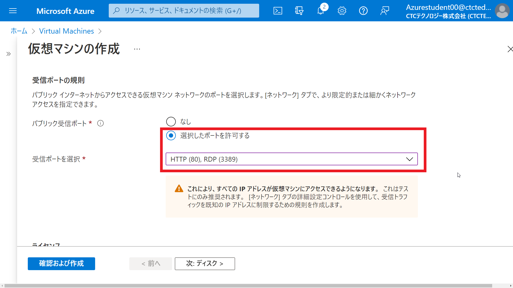

     

8. ライセンス項目は変更せず、「**次：ディスク**」を選択します。

     

9. 「ディスクのオプション」で以下の選択してください。指定した箇所以外は変更しません。

   | 設定             | 値                                       |
   | ---------------- | ---------------------------------------- |
   | OSディスクの種類 | **Standard SSD(ローカル冗長ストレージ)** |

   

     

10. 「**次：ネットワーク**」をクリックしてください。

     

11. 「**ネットワークインターフェイス**」の [**仮想ネットワーク**]の項目で「**新規作成**」を選択します。

      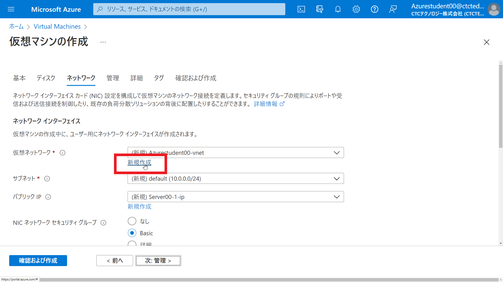

      

12. 「**仮想ネットワークの作成**」で以下の項目を入力し、「**OK**」を押します。

    | 設定                         | 値              |
    | ---------------------------- | --------------- |
    | 名前                         | **Vnet##**      |
    | （アドレス空間）アドレス範囲 | **10.#.0.0/16** |
    | サブネット名                 | **Subnet01**    |
    | アドレス範囲                 | **10.#.1.0/24** |

    > 注：##は受講番号です。01 ～ 99の数字が入ります。
    >
    > 注：#は受講番号です。01～09の人は"0"を抜かしてください。1 ～99の数字が入ります。

    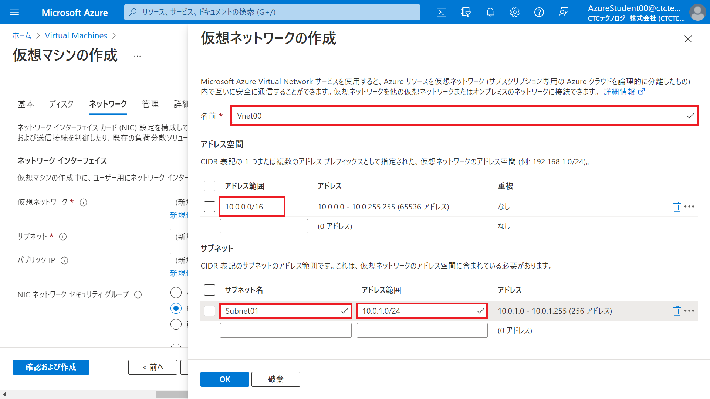

    

13. 項番 13 で設定した「仮想ネットワーク」と「サブネット」に変更されたことを確認します。

      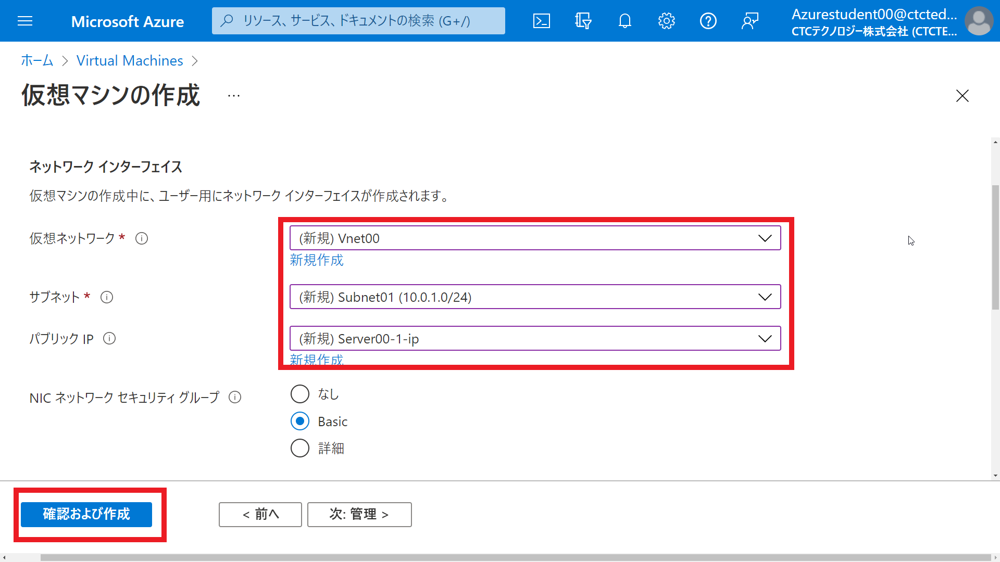

      

14. 以降の設定はデフォルトのまま、「**確認および作成**」を選択します。

      

15. 「検証に成功しました」と表示されたら、画面左下部の「**作成**」を選択します。

      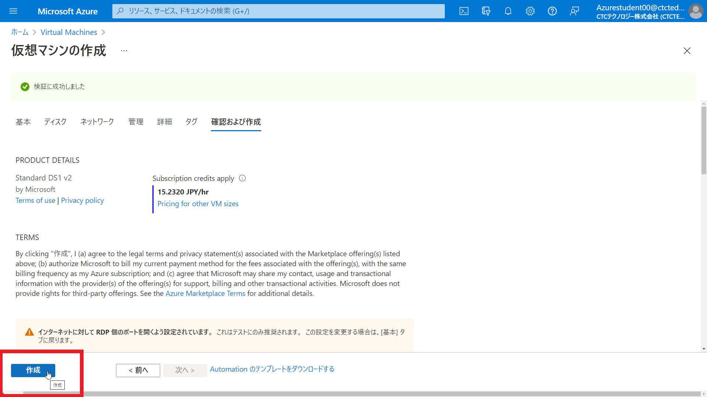

      

16. 2~5 分ほどで仮想マシンの作成が完了となります。

     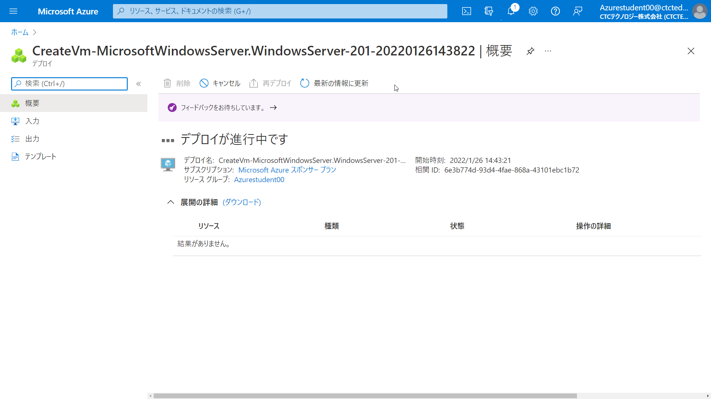

      

19. デプロイ完了後、「リソースに移動」を選択してください。

    
    
    
    
19. 作成した仮想マシンブレードが表示されます。 画面内にある「パブリック IP アドレス」をコピーしてメモ帳に控えてください。 

      > 注：パブリックIPアドレスはWebページの閲覧時に使用します。

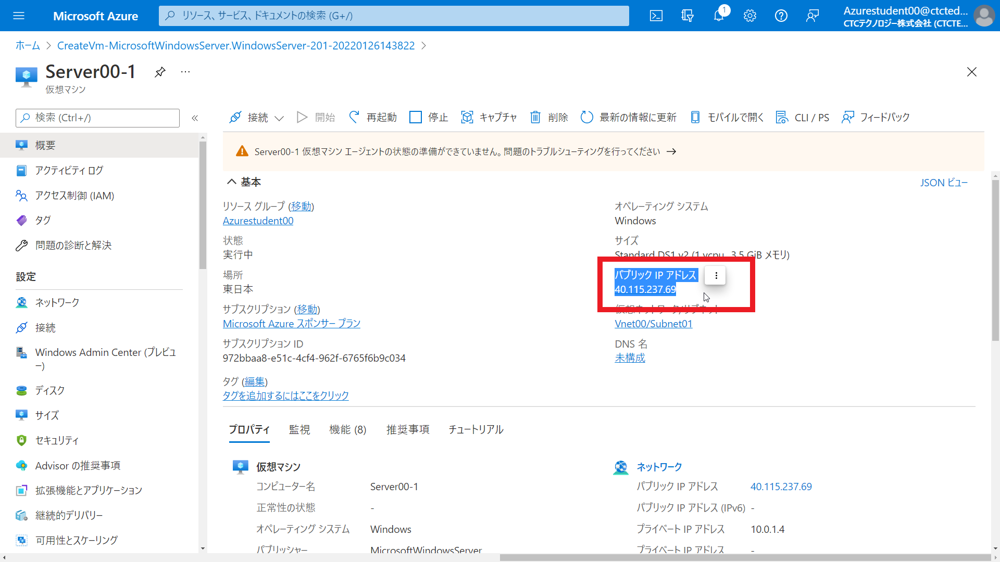


### タスク 2 - 仮想マシンに「RDP 接続」でアクセスする

> 注：Bastion 接続を行う場合は、[Lab01-02_Access_Virtual_Machine_Bastion](https://github.com/ctct-edu/az-900-lab-1day/blob/main/LabManual/Lab01_02_Access_Virtual_Machine_Bastion.md)へアクセスして実施してください。

1. 仮想マシンブレードで「**接続**」をクリックし、仮想マシンの接続ブレードに移動します。

   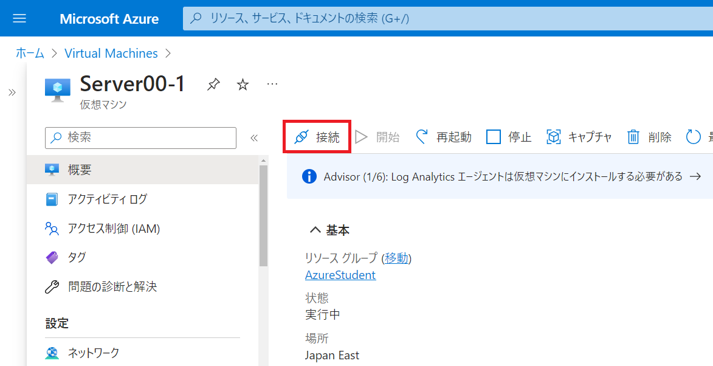

   

2. 「**ネイティブRDP**」の項目で「**選択**」のボタンをクリックし、表示されたメニューから「**RDP ファイルのダウンロード**」をクリックしてください。

   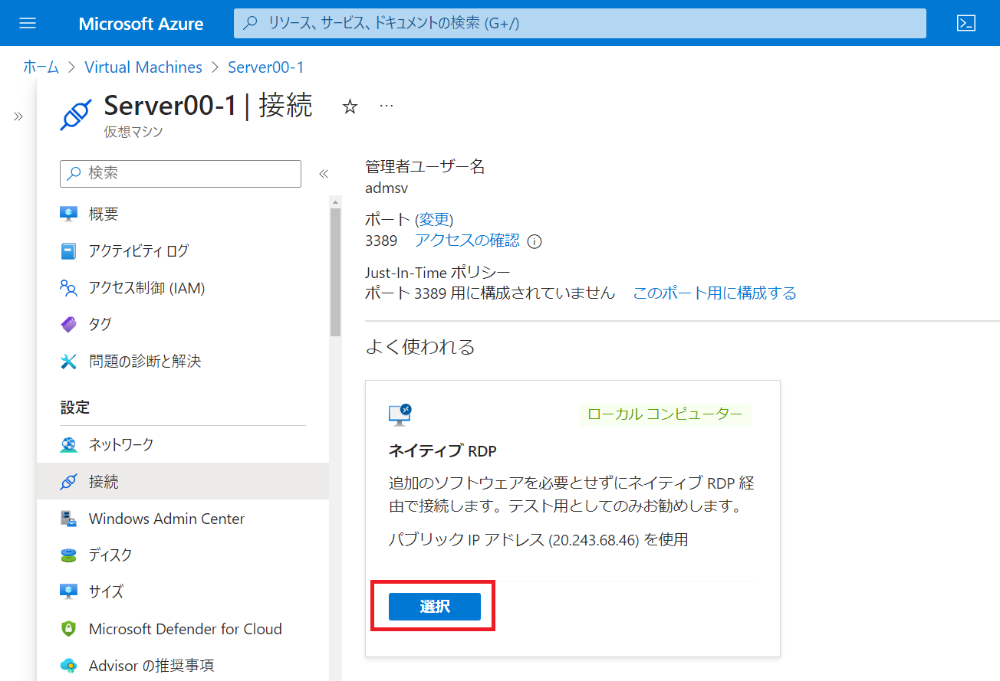

   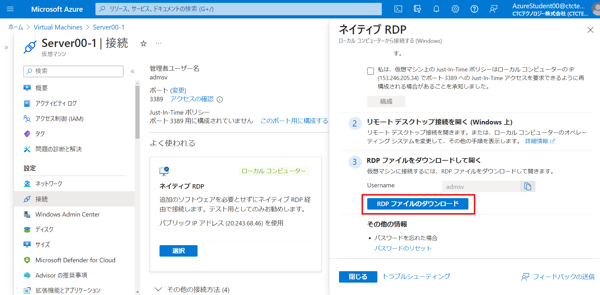

   

3. ダウンロードした RDP ファイルをクリックし、Windows 認証を行いサインインしてください。

   | **設定**   | **値**              |
   | :--------- | :------------------ |
   | ユーザー名 | **admsv**           |
   | パスワード | **Pa55w.rdabc1234** |

   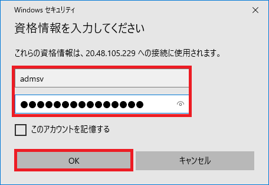

   

4. Windows Server のデスクトップ画面が表示されます。初期設定で以下の項目が表示されます。「NO」を選択します。

   > 注：この設定は演習には影響しません。

   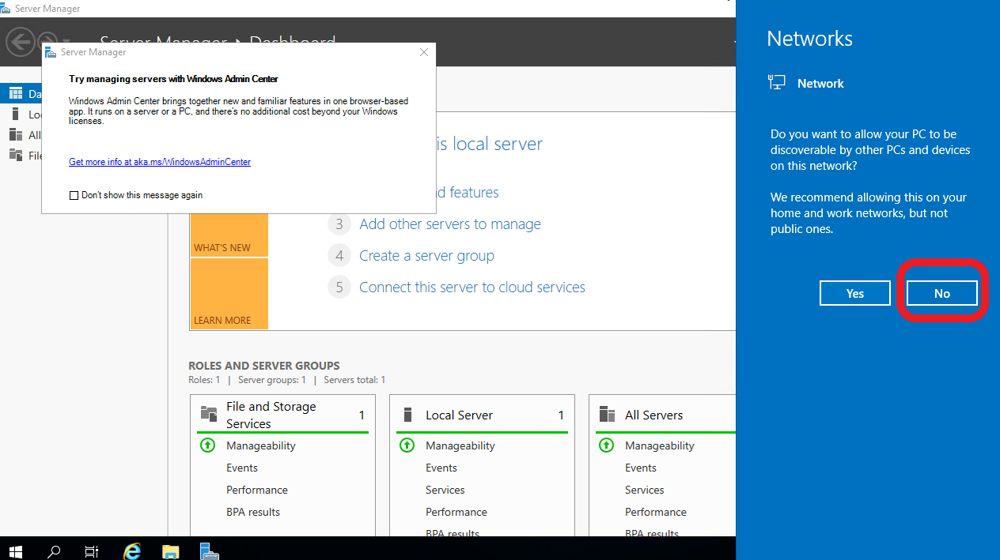

   

6. Server Manager が自動で起動しますが、全て「×」で閉じます。


### タスク 3 - Internet Information Services (IIS)をインストールする

1. RDP接続先のマシンにて、スタートメニューから「**Powershell**」を起動します。

   

   

2. 起動した Powershell で以下のコマンドを実行してください。

   ```powershell
   Install-WindowsFeature -name Web-Server -IncludeManagementTools
   ```

   > 注：これはIIS をインストールするコマンドです。

   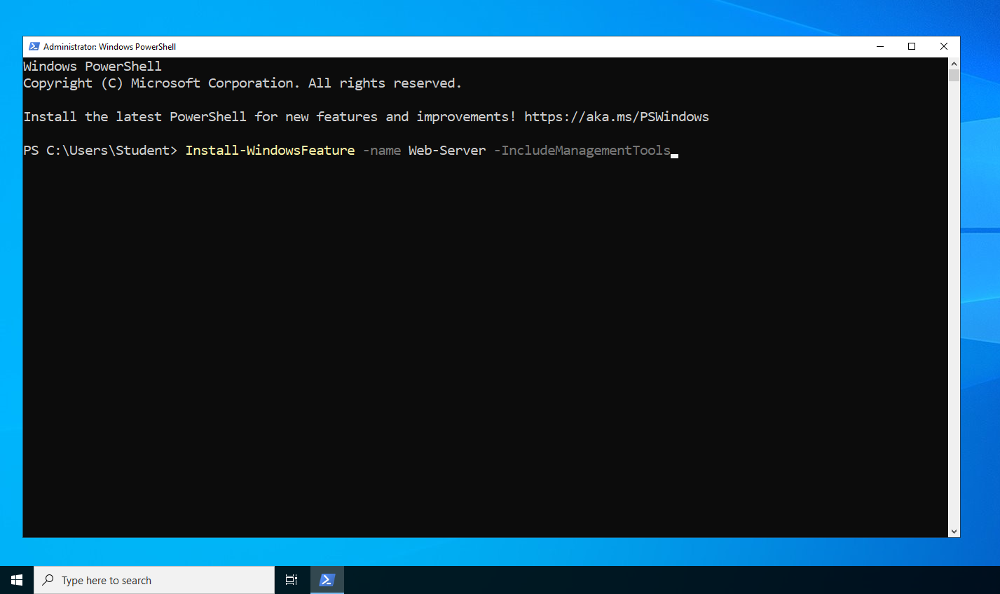

   

3. IS のインストールが開始されます。100%になるまで待ちます。

   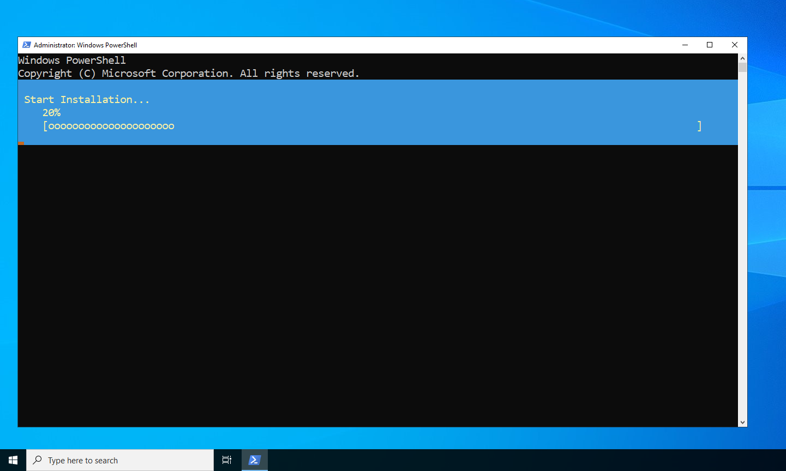

   

4. .IIS のインストールが完了し Exit Code が「**Success**」になったことを確認してください。

   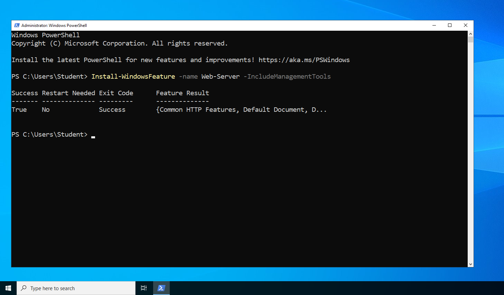

   

5. リモートデスクトップ画面を最小化してください。

     

### タスク 4 - IIS のサンプルページに Web ブラウザーからアクセス

1. . Web ブラウザーを起動してください。

   > 注：ブラウザーはどれでも可能です

   

2. アドレスバーに「**http://仮想マシンのパブリック IP アドレス**」を入力してください。

   > 注：タスク2-19でメモしたパブリックIPアドレスです。
   >
   > 注：例としては http://11.22.33.44 などになります。

   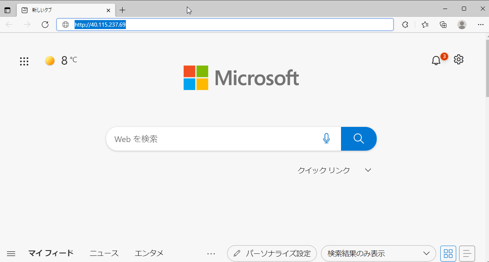

   

3. IIS のサンプルページが表示されます。

   


これで仮想マシンの構築とIISを構築し、Webサーバーを公開することができました。

演習は終了です。お疲れ様でした。
